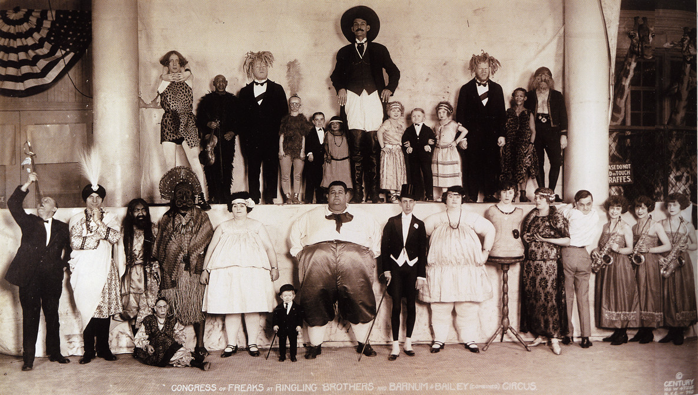

You are in the Freak Show because you have no other option. Even if you're not visibly different, there is something that sets you aside from normal society. Maybe you made yourself different on the outside too even though you weren’t like that to start with.
{:.lead}

These are the roles available in the Freak Show. When you've chosen one or more roles you like, go ahead and <a href="apply.html">apply to take part!</a>. The roles are quite open to interpretation and we will work together with you to flesh them out. Some of the roles have <strong>special requirements</strong> in the form of makeup, props or other preparations. Information about these requirements are listed with the character.

These character descriptions are written from many different viewpoints, some are the character’s inner speech, some are what the presenters say of them on the stage, some what others think of them and some the way they see themselves. We expect you to to take the text as inspiration and evolve the idea further.




    

        <h2>The Freaks</h2>
        

            <em>The Freaks</em>, all have some clearly visible factor that makes them unfit to normal society. They are the star performers of the Freak Show, and also those who receive the most hate.
        

        

            <ul class="characters">

                
                    <li class="clearfix">
                        
                            

                                
                            

                        
                        

                            {{ character.title }}
                            {{ character.role }}
                        

                        
{{ character.description }}
                        
                        
                            
<strong>Requirements:</strong> {{ character.requirements }}

                        
                        
                            
<strong>Current applications:</strong> {{ character.applications }}

                        
                    </li>
                
            </ul>
        

    

    

        <h2>The Circus Folk</h2>
        

            <em>The Circus Folk</em> travel and work with the circus, but are not visibly different. All of them are not performers, but all are somehow not normal.
        

        

            <ul class="characters">

                
                    <li class="clearfix">

                        
                            

                                
                            

                        

                        

                            {{ character.title }}
                            {{ character.role }}
                        

                        

                            {{ character.description }}
                        

                        
                            
<strong>Requirements:</strong> {{ character.requirements }}

                        
                        
                            
<strong>Current applications:</strong> {{ character.applications }}

                        
                    </li>
                
            </ul>
        

    

