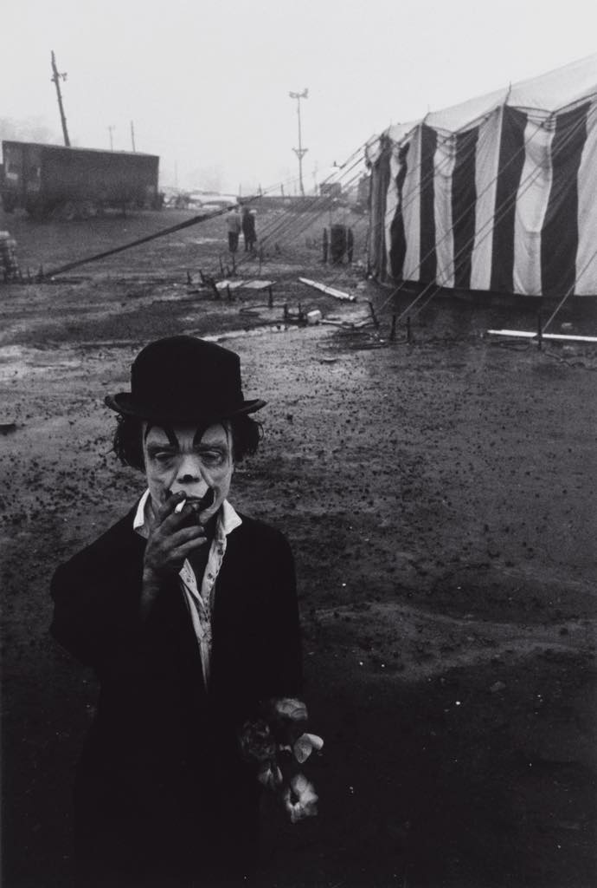

## Get in Touch With Us

If you want to get in touch with us for any reason at all, send an email to <a href="mailto:###">####</a>.

We have a Facebook group that you should join:

## Who is organising Freak Show?

That would be us!

### Nina Teerilahti

Nina is awesome and came up with this whole project. Awesome, I say.

What Nina does in the LARP.

### Dominika Cembala

Short description of Dominika

What Dominika does in the LARP.

### Alessandro Giovannucci

Short description of Alessandro

What Alessandro does in the LARP.

### Simon Brind

### Martin Olsson

Martin is from Sweden, and started LARPing in the early 90s. As an organiser he's been involved in some Swedish classics, such as Det Sista Kapitlet, Hamlet Inifrån, and Skyrmion. In the Freak Show he works with writing characters and other texts and is also responsible for the web site.
