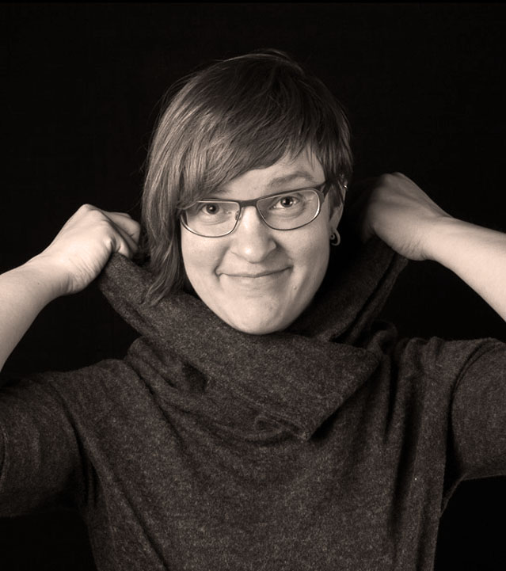
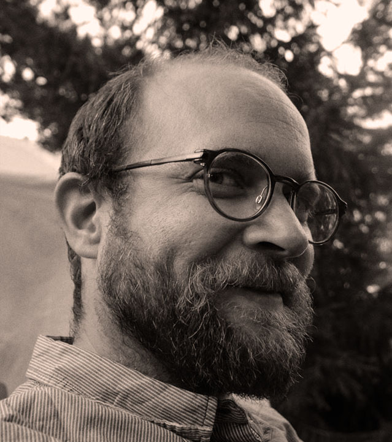
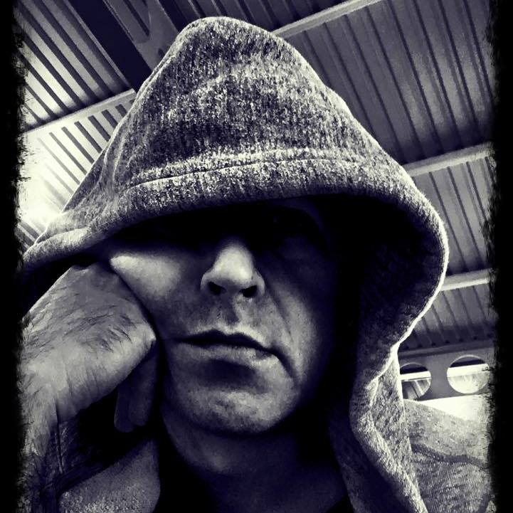
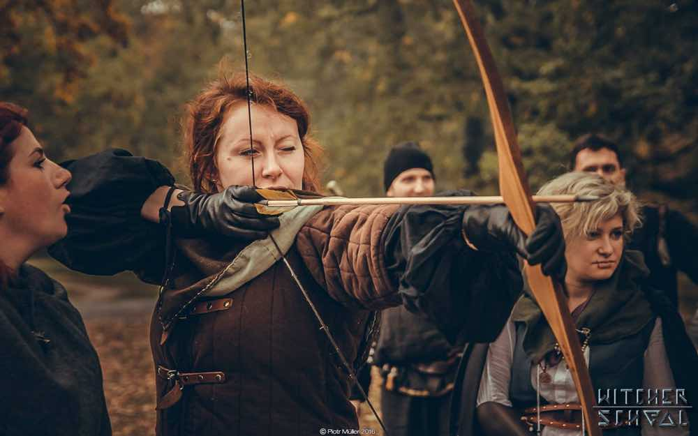
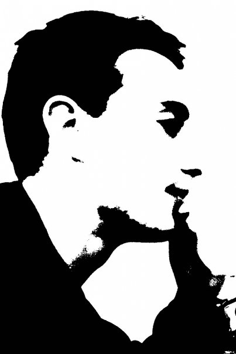
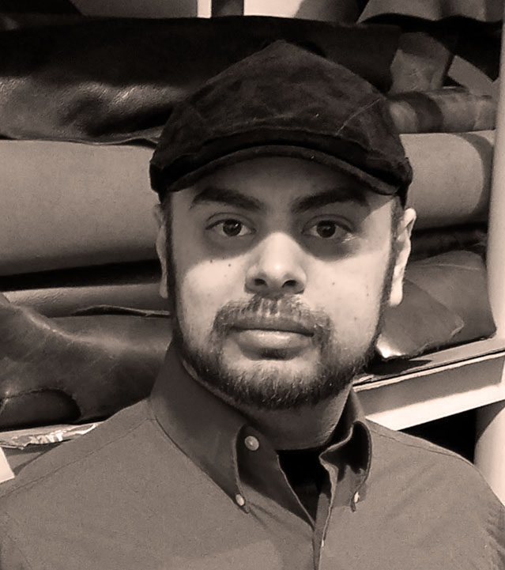

That would be us, in order of proximity to the abandoned amusement park Wasalandia. If you want to get in touch with us for any reason at all, send an email to <a href="mailto:{{ site.email }}">{{ site.email }}</a>. We have a Facebook group for the larp: <a href="{{ site.facebook_url }}" target="blank">Facebook Group</a>.
{:.lead}

## Nina Teerilahti

Nina is a 37 year old Finnish artist, comic artist, illustrator, graphic designer and a trained producer. She started this project.

Nina is enthusiastic about larp as an art form and has been active in the international scene since 2014. She has co-organized two international larps in Finland and played games all around Europe. All Nina’s art is very strongly story and emotion driven and larp is by far the strongest media to convey stories and emotions she has encountered. Best stories are shared and created together.

As a larp creator Nina is all about creating immersion and strong emotions. She aims at creating cathartic experiences for the players to dive into.

{:.clearboth}

## Martin Olsson

Martin started larping in the early 90s, and has been searching for fleeting moments of unreality ever since. He's been involved in some Swedish classics, such as Det Sista Kapitlet, Hamlet Inifrån, and Skyrmion. Martin has also created larps in professional settings, ranging from team kickoffs to political simulations for thousands of participants. Also a puppet movie<a href="http://thepostofficemovie.com">.</a>  

{:.clearboth}

## Simon Brind

Simon is a British writer and academic. He has been a larper since 1986 and in that time he has designed and written for all manner of games, larps, and performances. The smallest was for one player, the largest for thousands.

Simon’s passion is for stories in larp that manifest organically and how they seem to be both ephemeral and eternal at the same time. He secretly believes they might be literally magic.

As a larp writer Simon’s primary interest is how to balance the storyteller’s art with both player and character agency. He specialises in plot actuation, and dramaturgy in times of narrative chaos. His favourite larps are ones that create powerful emotions, military grade bleed, and memories that last forever.

{:.clearboth}

## Dominika Cembala

Dominika started larping with her first rp team in 2008, with a break somewhere in the middle. She's mostly known as a larp participant than a creator, although she did lend a hand in a major revamp of one of the blockbusters.
A magical book kickstarted her creative thinking about a project similar to Freak Show, and larping alongside Nina this one time led to this amazing adventure co-creation.

She still can't believe this is happening. But is so excited that it will!

{:.clearboth}

## Alessandro Giovannucci

Alessandro is an academic lecturer and larp designer, one of the founders of Chaos League and co-author of Southern Way - New Italian LARP manifesto, as well as organizer of international high-budget games (Black Friday, New Atlantis) and LARP festivals (Play Larp). In the Freak Show he works with writing characters and plot.

{:.clearboth}

## Morgan Kollin

Hailing from Detroit, Michigan, Morgan has around 21 years of LARPing experience, starting with KANAR in Michigan, then expanding to Chicago, San Diego, Iowa, and Indianapolis.  He has been involved with numerous events and organizations throughout the years and has worked on various systems, including an upcoming Steampunk LARP. Always working on one project or another, Morgan is also the Founder of the Detroit Leather Company and Larp Garb, and hosts Youmacon, one of the 10 largest Anime conventions in North America.
