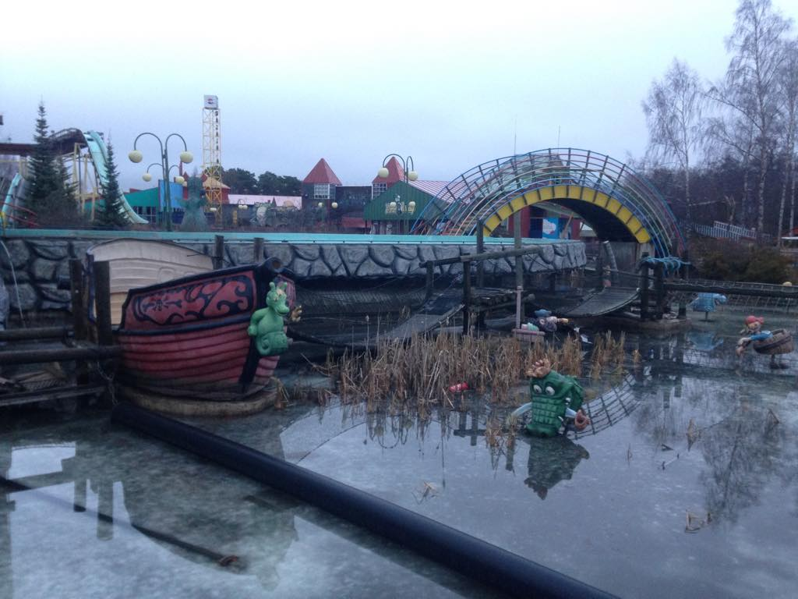

Here's all(?) you need to know about Freak Show. If we missed something, or if something is not clear, please ask in our <a href="{{ site.facebook_url }}" target="_blank">Facebook Group</a> or E-mail us: <a href="mailto:{{ site.email }}">{{ site.email }}</a>.

    

        
    

    

        
    

## Dates

The LARP runs from __Friday the 15th of September__ to __Sunday the 17th of September__. We will have workshops on Friday, and an after-party on Sunday. We will start the LARP on Friday night or Saturday morning (to be decided). You should plan on arriving no later than ##:## on Friday, and we hope you want to join the party after.

    

        <h2>Location</h2>
        
The LARP will be held in an abandoned amusement park in Vaasa on the west coast of Finland. Vaasa is a medium sized town with around 70 000 inhabitants.

        <h2> Getting there and getting home</h2>

        
It's often much cheaper and easier to find flights to Helsinki. We are organising a bus from Helsinki. If you want to join the bus ########

    

    

        <iframe src="https://www.google.com/maps/embed?pb=!1m18!1m12!1m3!1d1805.6974552588708!2d21.584958316240392!3d63.09089888312916!2m3!1f0!2f0!3f0!3m2!1i1024!2i768!4f13.1!3m3!1m2!1s0x467d6063c94320c1%3A0xc299018ef6db9a99!2sWasalandia!5e0!3m2!1ssv!2sse!4v1485296734724" width="600" height="450" frameborder="0" style="border:0" allowfullscreen></iframe>
    

## What do I need to bring?

## Is the LARP accessible with a wheel-chair?

Yes, many of the areas are accessible, but there are some difficult areas. ####

## How do I apply?

We have decided to use a casting process where you apply for your favorite character (out of the ones listed on this website). <a href="apply.html">Join the Freak Show</a>.

## How much does it cost and how do I pay?

The LARP costs €350. Once you have been selected for a role you must pay within 30 days, in through [DevilPal]().

## What is included in the price?

## Why is the LARP so expensive?

Most of the costs of the participating in Freak Show goes to renting the location, the camping site and catering. None of the organisers are being paid. If we have money left over we will give it to <a href="http://larpfund.org/" target="_blank">Larp Fund</a>.

<table>
    <thead>
        <tr>
            <td>This is our rough budget for 45 players:</td>
            <td><b>€</b></td>
        </tr>
    </thead>
    <tr>
        <td>Food</td>
        <td>3 570</td>
    </tr>
    <tr>
        <td>Accomodation</td>
        <td>3 120</td>
    </tr>
    <tr>
        <td>Lilliputi train</td>
        <td>250</td>
    </tr>
    <tr>
        <td>Tents, light and sound system</td>
        <td>3 100</td>
    </tr>
    <tr>
        <td>Devil costume</td>
        <td>600</td>
    </tr>
    <tr>
        <td>Other props</td>
        <td>2 000</td>
    </tr>
    <tr>
        <td>Transports</td>
        <td>600</td>
    </tr>
    <tr>
        <td>Wheelchair accessibility</td>
        <td>1 400</td>
    </tr>
    <tr>
        <td>Total</td>
        <td><u>15 680</u></td>        
    </tr>
</table>
