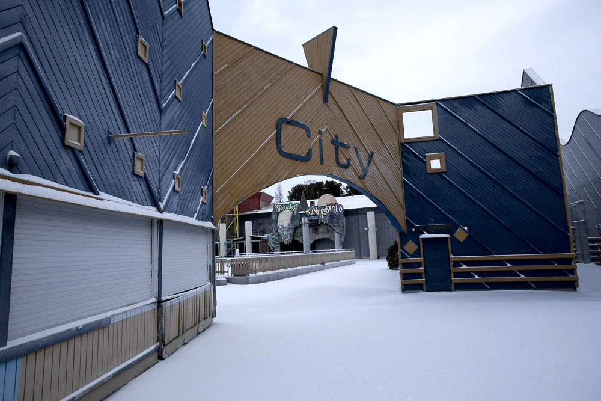
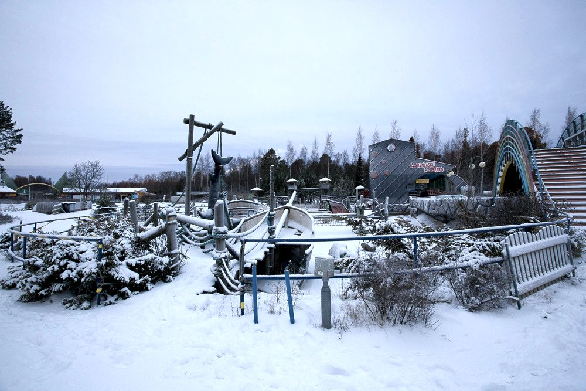
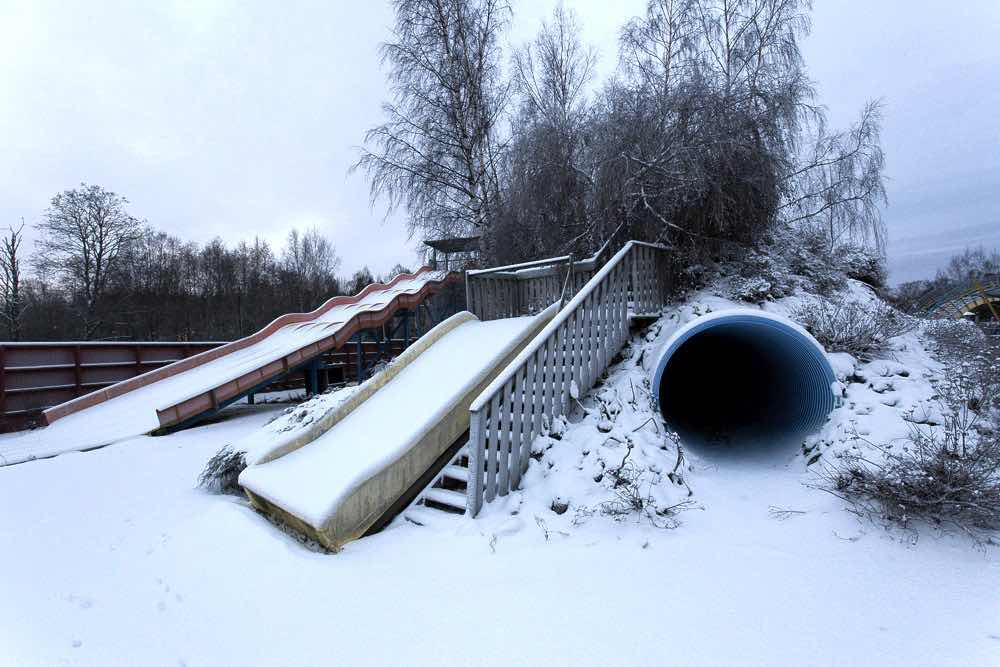
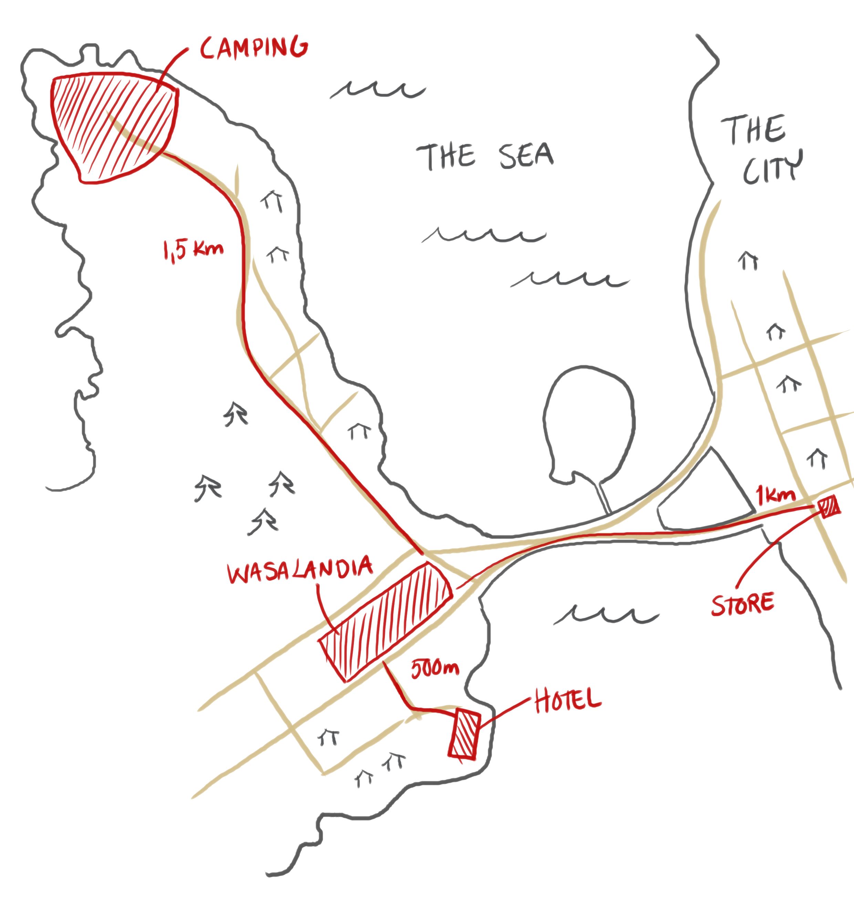

Here's all the practical info about attending the game. If you have further questions, contact us in the <a href="{{ site.facebook_url }}" target="_blank">Facebook Group</a> or E-mail us: <a href="mailto:{{ site.email }}">{{ site.email }}</a>.

Freak Show larp
15.9. 20:00 - 18.9.2017 10:00 in Vaasa, Finland
Workshops, 36 hours in game, after party
45 participants
350 €/person

Keywords: Nordic Style/360/art/full immersion/gothic horror/drama/otherness

We have applied for Larpfund, info on possible discount tickets later.

Once you have been cast to a role we expect payment in 30 days via bank transfer or Paypal.

## The site and getting there

    

    

    

    

        
The site of the game is the abandoned Wasalandia amusement park in the city of Vaasa in Finland and a nearby camping area, Top Camping Vaasa. The site is a 5 to 6 hour drive from the capital Helsinki. Helsinki is most likely the cheapest airport to fly to.

We will arrange an optional shared bus to the site and back from Helsinki Airport. We can’t arrange a wheelchair friendly bus from Helsinki airport, but if you have a wheelchair and need help with transport, we can arrange a local helper to help you to get to and from the site by train.

    

    

        

            <iframe src="https://www.google.com/maps/embed?pb=!1m18!1m12!1m3!1d1805.6974552588708!2d21.584958316240392!3d63.09089888312916!2m3!1f0!2f0!3f0!3m2!1i1024!2i768!4f13.1!3m3!1m2!1s0x467d6063c94320c1%3A0xc299018ef6db9a99!2sWasalandia!5e0!3m2!1ssv!2sse!4v1485296734724" width="600" height="450" frameborder="0" style="border:0" allowfullscreen></iframe>
        

    

## Casting and Creating characters

Initial casting will be done anonymously based on a short form. We will build your character with you. We expect you to put both time and effort into creating your character and character relationships before the event.

## Game area

There are two game areas with 1,5 km in between, the Top Camping Vaasa camping site and the Wasalandia amusement park. Both areas are reserved for us as a private event. In addition to these sites lunch and dinner will be served in a nearby hotel’s restaurant 500 m from the amusement park. This space is also private.

## Safe Space

There will be designated safe space where you can go to be offgame, talk or have a hug. There will be a person you can talk to on duty at the safe space at all times.

## Sleeping, eating and showering

### Sleeping
There will be bunk beds in 4 person camping cabins. The sleeping places will be assigned by character, so you will not know who you will share a room with. The cabins have quite tight spaces and there is a 10cm doorstep to get in. Some cabins have one bunk bed and one double bed and these can be used if it makes using the cabin easier.

    

### Showers and toilets
At the camping site showers, toilets and kitchens are in separate buildings. There is a wheelchair friendly toilet. The showers have space but are not fully accessible.

At the amusement park we have toilets and water in the old worker’s locker rooms but these have a staircase and are not accessible. We will get a portable wheelchair friendly toilet to the park if needed.

There will be a sauna heated at the campsite on Saturday and Sunday from 22-00.

### Catering
The game includes three meals per day. Breakfast at 9:00, lunch at 12:00 and dinner at 17:00. You are free to bring snacks or buy them from nearby stores. The closest store is 1 km from the amusement park and 2,5 km from the camping site. The camping site has kitchens with all the basic appliances.

On sunday there will be an afterparty and the camp site’s pub will be open just for us.

## Moving around the site

There is a 1,5 km distance between the two game areas. You will need to cover this distance at least twice per day. There will be a little train to drive us from the campsite to the amusement park in the mornings and back in the evenings, but it is not wheelchair accessible.

Lunch and dinner will be served at a nearby hotel restaurant which is 500 m away from the park. This distance needs to be covered twice per day.

The roads are flat and in good condition.

We will sleep at the camping, but the main game will happen at the amusement park. The amusement park’s main areas are accessible, but there are areas not easily accessible. The main events will not happen in areas with difficult accessibility.

## Other things to note

### Weather

The average temperature at the time of the game is around from nightly lows of 5°C to daily highs of 10°C. It can get as cold as 0°C or as warm as 15°C, but it’s uncommon. Rain is likely and the site is by the sea so there will be wind. Dress warm and to shelter you from the wind and possible rain. Plan your costume and props with this in mind. The sleeping cabins have heating, but the other game areas don’t.

### WiFi

There is limited Wifi at the camping site in the reception cabin only

## Accessibility / Disability

We take accessibility seriously.  If you have specific needs please contact us as early as possible so that we can try to make it possible for you to attend this game.
<a href="mailto:freakshow@gmail.com">freakshow@gmail.com</a>
