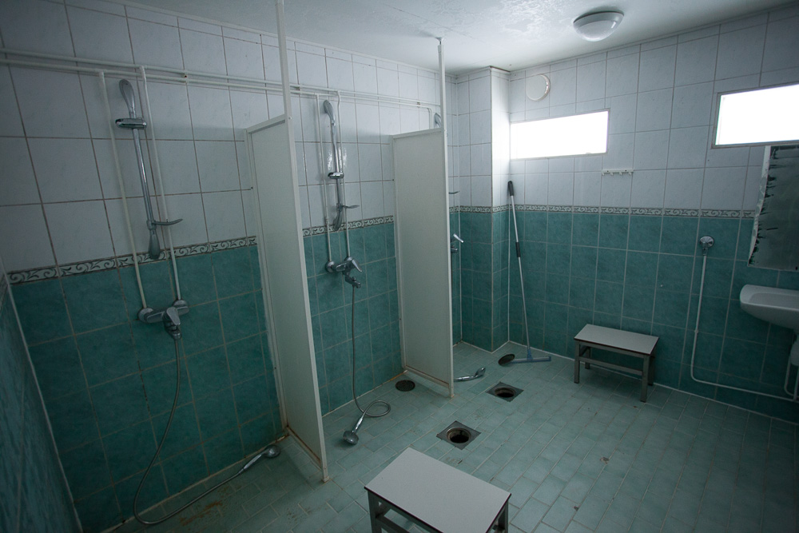
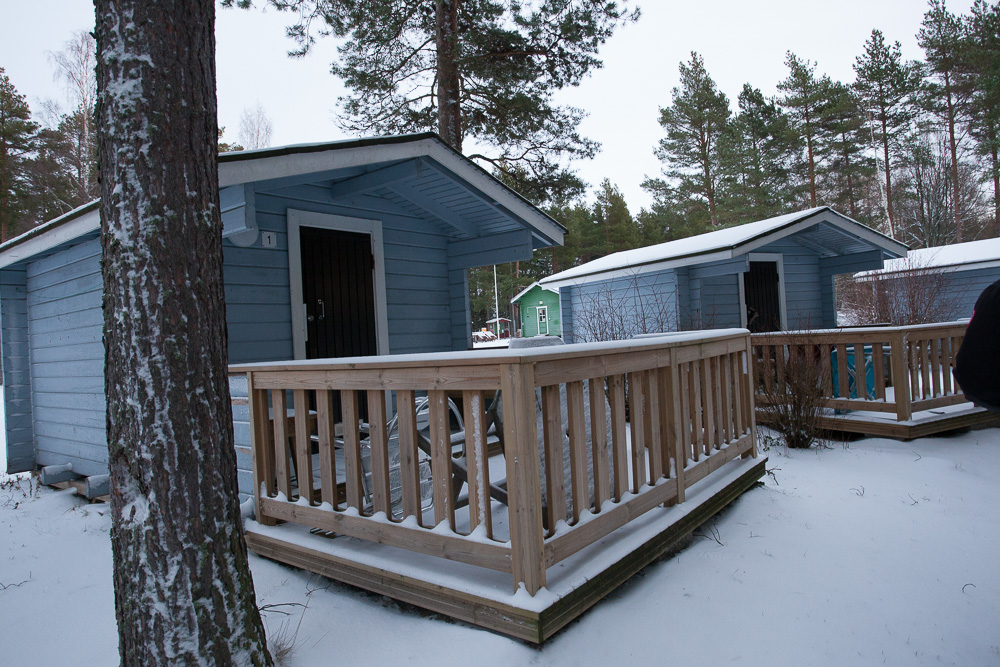
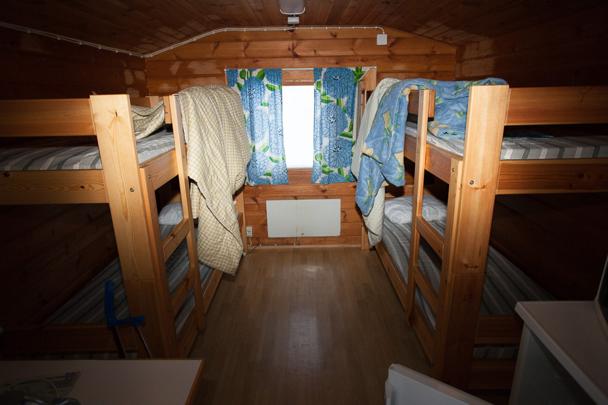

Here's all(?) you need to know about Freak Show. If we missed something, or if something is not clear, please ask in our <a href="{{ site.facebook_url }}" target="_blank">Facebook Group</a> or E-mail us: <a href="mailto:{{ site.email }}">{{ site.email }}</a>.

## Dates

The LARP runs from __Friday the 15th of September__ to __Sunday the 17th of September__.

## Price and payment

350 €/person

Once you have been cast to a role we expect payment in 30 days via bank transfer or Paypal.

There will be Larpfund tickets available at half price, if we get them. People with disabilities who need an assistant (personal assistant or an interpreter) to take part in the game will be prioritized to get the assistant into the game for free.

## The site and getting there

    

    

    

    

        <h2>Location</h2>
        
The site of the game is Wasalandia amusement park in the city of Vaasa in Finland and a nearby camping area, Top Camping Vaasa. The site is a 5 to 6 hour drive from the capital Helsinki. Helsinki is most likely the cheapest airport to fly to.

        
Note that these pictures are old and from the time that the park was still open to public. It is a bit different now.

        
We will arrange an optional shared bus to the site and back from Helsinki Airport.

    

    

        

            <iframe src="https://www.google.com/maps/embed?pb=!1m18!1m12!1m3!1d1805.6974552588708!2d21.584958316240392!3d63.09089888312916!2m3!1f0!2f0!3f0!3m2!1i1024!2i768!4f13.1!3m3!1m2!1s0x467d6063c94320c1%3A0xc299018ef6db9a99!2sWasalandia!5e0!3m2!1ssv!2sse!4v1485296734724" width="600" height="450" frameborder="0" style="border:0" allowfullscreen></iframe>
        

    

## Casting and Creating characters

Initial casting will be done anonymously based on a short form. We will build your character with you. We expect you to put both time and effort into creating your character and character relationships before the event.

## Event schedule

<section class="box special">

### Friday

Arrival to the site starting from 17:00. Workshops from 20:00.

### Saturday

In game from 8:00.

### Sunday

Game end around 20:30.
After party from 21:00.

### Monday

Leaving the site at morning.

</section>

## Game area

There are two game areas with 1,5 km in between, the camping site and the amusement park. Both areas are reserved for us as a private event. In addition to this lunch and dinner will be served in a nearby hotel’s restaurant 500 m from the amusement park. This space is also private.

## Safe Space

There will be designated safe space where you can go to be offgame, talk or have a hug. There will be a person you can talk to on duty at the safe space at all times.

## Accommodation and food

There will be real beds in 4 person camping cabins. The sleeping places will be assigned by character, so you will not know who you will share a room with.

    

Showers, toilets and kitchens are in separate buildings at the camping site.

There will be 3 meals per day. Breakfast at 9, lunch at 12-13 and dinner 16-17. Breakfast will be served in take away bags in the campsite at morning and lunch and dinner will be served at a hotel restaurant 500m from the amusement park.

There is a store 1km from the amusement park where you can buy additional snacks. The camping site has kitchens with all the basic appliances.

There will be a sauna heated at the campsite on Saturday and Sunday from 22-00.

On Sunday after the game there will be an afterparty and the camp site’s pub will be open just for us.

## Other things to note

### Weather

The average temperature at the time of the game is around from nightly lows of 5°C to daily highs of 10°C. It can get as cold as 0°C or as warm as 15°C, but it’s uncommon. Rain is likely and the site is by the sea so there will be wind. Dress warm and to shelter you from the wind and possible rain. Plan your costume and props with this in mind. The sleeping cabins have heating, but the other game areas don’t.

### WiFi

There is limited Wifi at the camping site in the reception cabin only

## Accessibility / Disability

We take accessibility seriously.  If you have specific needs please contact us as early as possible so that we can try to make it possible for you to attend this game.

### Getting to the site

We can’t arrange a wheelchair friendly bus from Helsinki airport, but if you have a wheelchair and need help with transport, we can arrange a local helper to help you to get to and from the site by train.

### Toilets and showers

There is a wheelchair friendly toilet at the camping site and if needed, we will get a portable one to the amusement park.  Showers have space, but are not fully accessible.

### Accommodation

The cabins spaces are quite tight and there is a 10cm door step to get in. The beds are bunk beds, but some cabins have a double bed  and one bunk bed instead and those can be used if they make using the cabin easier.

### Catering

The game includes three meals per day. Breakfast at 9:00, lunch at 12:00 and dinner at 17:00. You are free to bring snacks or buy them from nearby stores.

## Moving around the site

There is a 1.5 km distance between the two game areas. You will need to cover this distance at least twice per day. There will be a little train to drive us to the from the campsite to the amusement park in the mornings and back in the evenings, but it is not wheelchair accessible.

Lunch and dinner will be served at a nearby hotel restaurant which is 500 m away. This distance needs to be covered twice per day.

The roads are flat and in good condition.

We will sleep at the camping, but the main game will happen at the amusement park. The amusement park’s main areas are accessible, but there are areas not easily accessible. The main events will not happen in areas with difficult accessibility.

## Please contact us

If you have any concerns or something we could provide to make it possible for you to attend this LARP, please contact us, we will see what we can do.

<a href="mailto:freakshow@gmail.com">freakshow@gmail.com</a>
